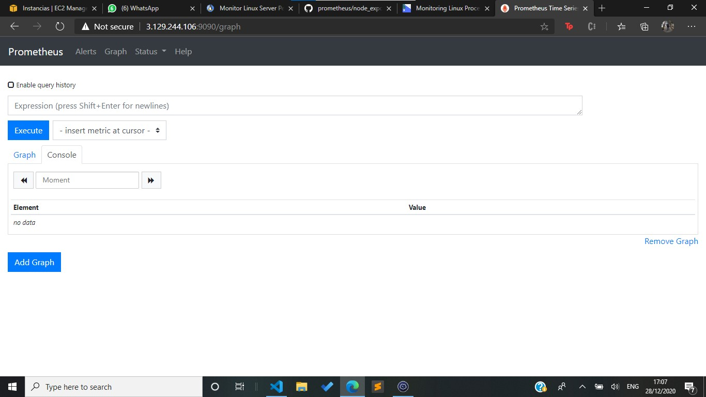
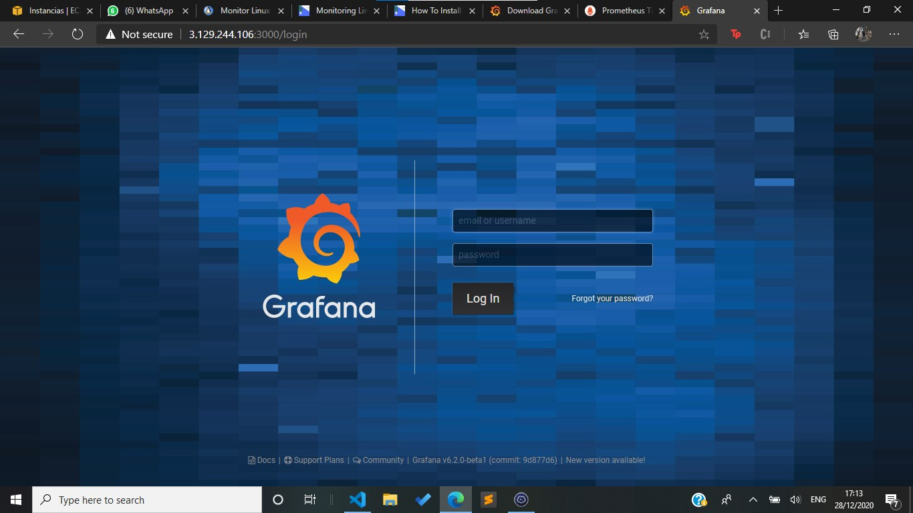

# MANUAL DE INSTALACION Y CONFIGURACION PROYECTO
---

## Laboratorio Sistemas Operativos 2
### Vacaciones de Diciembre 2020
---

| Carnet | Nombre |
| ------ | ------ |
|200511819     |     Pablo Gerardo Garcia Perusina |
|201602517     |     Marvin Saul Guzman Garcia|
|201602811     |     Oscar Ariel Corleto Soto|

> Guatemala, 29/12/2020

---
---
## INDICE

- Introduccion

- Intalacion y Configuracion Prometheus

- Instalacion y Configuracion Grafana

- Querys Utilizadas

---
---
## Introduccion

> El siguiente Manual Técnico se realizó para que el lector con conocimientos básicos de sistemas operativos, pueda instalar y configurar Prometheus y Grafana para que sea los motores de monitoreo de un sistema operativo

---
---
## Intalacion y Configuracion Prometheus

> Paso 1: instalamos Pushgateway

Este programa es lo que utiliza proteus para obtener la informacion de la maquina virtual, utilizamos el siguiente comando:

`wget https://github.com/prometheus/pushgateway/releases/download/v0.8.0/pushgateway-0.8.0.linux-amd64.tar.gz`

desempaquetamos e instalamos

` tar xvzf pushgateway-0.8.0.linux-amd64.tar.gz`

` cd pushgateway-0.8.0.linux-amd64/   `

` ./pushgateway & `

>Paso 2: Instalacion Prometheus

Desde la pagina de Prometehus buscamos el repositorio donde esta el archivo de instalacion y lo obtenemos:

` wget https://github.com/prometheus/prometheus/releases/download/v2.23.0/prometheus-2.23.0.linux-amd64.tar.gz `

Desempaquetamos e instalamos

` tar xvzf prometheus-2.9.2.linux-amd64.tar.gz`

` cd prometheus-2.9.2.linux-amd64/  `

>Paso 3: Script de Configuracion

creamos un archivo .yml en el cual se le da acceso al puerto y otras configuraciones al programa

`nano prometheus.yml`

>Paso 4: Ejecutamos

Ahora ejecutamos el instalador descargado con

`sudo apt install prometheus`

y verificamos que ya podemos conectarnos desde la ip

---
---
## Instalacion y Configuracion Grafana

>Paso 1: Descarga e Instalacion

Descargamos el paquete de grafana y lo desempaquetamos para instalar

`wget https://dl.grafana.com/oss/release/grafana_6.2.0-beta1_amd64.deb`

`sudo dpkg -i grafana_6.2.0-beta1_amd64.deb`

Ahora que ya esta instalado solamente ejecutamos para poder entrar al servidor

`sudo systemctl status grafana-server`

>Paso 2: Iniciar Grafana

Una vez ejecutado el servidor podemos ingresar a la pagina principal de grafana en el navegador, Iniciamos sesion con `admin` de usuario y password.

> Paso 3: Conexion a Prometheus

Al iniciar en grafana nos pedira hacer una conexion para saber a donde jalar los datos para el monitoreo, entonces hacemos la conexion a Prometheus

>Paso 4: Crear Tablero

Para empezar a crear las graficas creamos un tablero en donde sirve como una coleccion de graficas

 

>Paso 5: Crear Graficas

Ahora  por ultimo creamos las graficas.

Primero colocamos la query y la conexiona Prometheus para poder obtenre los datos

Segundo se nos presenta el tipo de grafica que queremos crear, elegimos la correcta para cada una de los monitores.

Tercero, configuramos las labels y otras opciones de la grafica y por ultimo guardamos

>Paso 6: Visualizacion

Despues de crear todas las graficas necesarias configuramos a que se refresquen cada 5s entonces ya podemos visualizar los datos del monitoreo

---
---
## Querys Utilizadas

Para la memoria ram , total y usada se corren las siguientes querys.

>Porcentage de memoria usada

`(((node_memory_MemTotal_bytes/1024/1024)-(node_memory_MemFree_bytes/1024/1024))*100)/(node_memory_MemTotal_bytes/1024/1024)`

>Porcentage de memoria libre

`(node_memory_MemFree_bytes/1024/1024*100)/(node_memory_MemTotal_bytes/1024/1024)`

>Memoria total en MB

`node_memory_MemTotal_bytes/1024/1024`

>Espacio Disponible en el Disco duro en GB

`(node_filesystem_avail_bytes/1024)/1024/1024`

>Trafico de red en Kilobytes

`rate(node_network_receive_bytes_total[1m])/1024`
