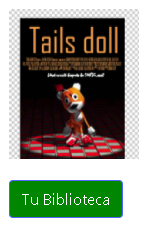

# MANUAL DE USUARIO PROYECTO
---

## Laboratorio Sistemas Operativos 2
### Vacaciones de Diciembre 2020
---

| Carnet | Nombre |
| ------ | ------ |
|200511819     |     Pablo Gerardo Garcia Perusina |
|201602517     |     Marvin Saul Guzman Garcia|
|201602811     |     Oscar Ariel Corleto Soto|

> Guatemala, 29/12/2020

---
---
## INDICE

- Introduccion

- Objetivos

- Requerimientos Tecnicos

- Funcionalidades y Uso del programa

---
---
## Introduccion

> El siguiente Manual de usuario se realizó para que el lector o Usuario pueda manejar y controlar todas las funciones de cada uno de los elementos de la aplicación (Sopes2-Gaming). 

---
---
##  Objetivos
* Instruir al usuario sobre como utilizar el servicio de compra de videojuegos.
* Mostrar, de forma gráfica, el funcionamiento del proyecto para mejor entendimiento visual.
---
---
## Funcionalidades y Uso del programa

### Registro
Al ingresar en esta pantalla, el usuario debe ingresar sus datos y credenciales para poder registrarse en el servicio. Una vez que los datos sean correctos (confirmación de contraseña correcta y no utilizar un nombre de usuario ya existente), este podrá loguearse en la plataforma.

### Login
En esta pantalla el usuario ingresa sus credenciales para poder acceder al portal.

### Principal
Página de ingreso.

### Tienda
Muestra la lista de todos los juego disponibles para descargar y comprar. Indica el nombre, precio, cantidad de descargas e imagenes del videjuego.

### Descarga
Los juegos que no han sido descargados por el usuario están disponibles para descargarlos, lo único que debe hacer es oprimir el botón de descargar.

Los videojuegos ya descargados muestran un botón que redirecciona a la página de biblioteca para acceder a ellos.

### Biblioteca
Esta página muestra todos los juegos que han sido descargados previamente por el usuario logueado.

### Cerrar Sesión
Al cerrar sesión se retiran las credenciales y se devuelve a la página de login.

---
---